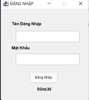

#  Đồ Án Môn Lập Trình Hướng Đối Tượng OOP - PTITHCM
 Phần Mềm Quản Lý Phòng Vé Máy Bay
 # Introduction
- Phần mềm quản lý phòng vé hỗ trợ các hoạt động của 1 phòng vé máy bay
  theo như quản lý máy bay, sân bay, đường bay, quản lý thông tin chuyến bay, quản
  lý thông tin hãng hàng không, quản lý thông tin khách hàng...
# Contributors
- GVHD :  `Nguyễn Thị Tuyết Hải`
- Người thực hiện : `Lê Phương Anh`

# Installation
- Chắc chắn rằng bạn đã cài môi trường lập trình java
nếu chưa có thể tải theo link sau:  [Tải ngay](https://docs.aws.amazon.com/corretto/latest/corretto-11-ug/downloads-list.html)
- Tải và cài đặt IDE: [Netbeans](https://netbeans.apache.org/download/nb126/nb126.html?fbclid=IwAR3MmI9hCnRs2_2c1nL4kl21yKWMJCJu55HAviGmnm37EH8IVlJZ_k0Ai8w)
- Tải source code phía trên và chạy bằng IDE vừa cài 

    `Lưu ý` : Nếu không kết nối được Database hãy dựng lại Database mới theo file backup trong đồ án.

# Screenshot

______
______

_____

____

